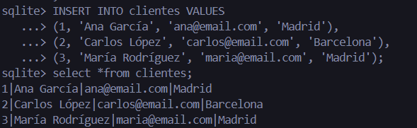
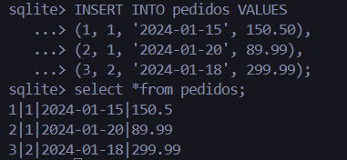
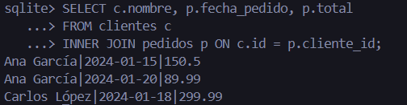
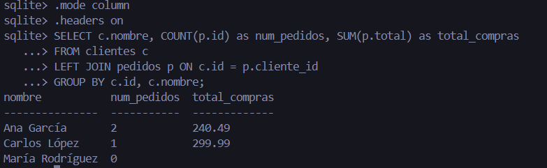
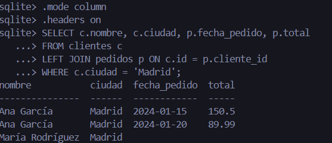
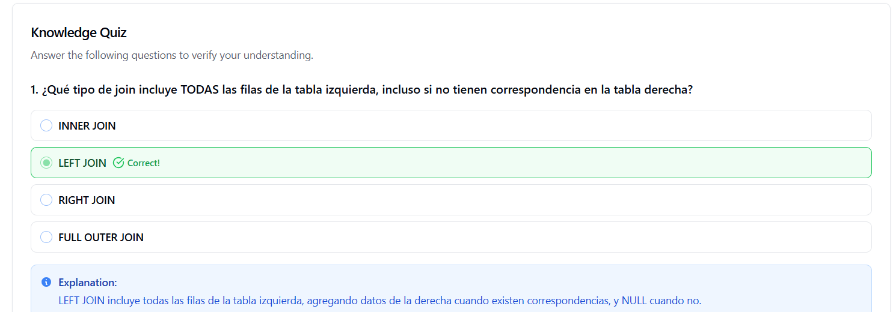

# **Ejercicio**: Consultas con joins en esquema de ventas
Ejercicio práctico para aplicar los conceptos aprendidos.
| Autor            | Fecha        | Día |
|------------------|--------------|----------|
| **Carlos Vásquez** |10 Noviembre 2025 | 3 |
## Crear esquema básico:
### En el Ejercicio Anterior la Tabla clientes  estaba configurada de esta manera
```sql
-- Crear tabla de clientes
CREATE TABLE clientes (
    id INTEGER PRIMARY KEY,
    nombre VARCHAR(100) NOT NULL,
    email VARCHAR(100) UNIQUE,
    fecha_registro DATE NOT NULL
);
```
### Para este ejercicio se va cambiar el campo ciudad 

```sql
ALTER TABLE clientes RENAME TO clientes_old;
```
```sql
DROP TABLE clientes_old;
```
### Crear tabla nueva de clientes 

```sql
-- Tabla de clientes
CREATE TABLE clientes (
    id INTEGER PRIMARY KEY,
    nombre TEXT NOT NULL,
    email TEXT UNIQUE,
    ciudad TEXT
);
```

```sql
-- Crear tabla de pedidos
CREATE TABLE pedidos (
    id INTEGER PRIMARY KEY,
    cliente_id INTEGER,
    fecha_pedido DATE NOT NULL,
    total DECIMAL(10,2),
    FOREIGN KEY (cliente_id) REFERENCES clientes(id)
);

```
### Renombra la tabla original:
```sql
ALTER TABLE pedidos RENAME TO pedidos_old;

```
### Crea la nueva tabla con el tipo correcto (REAL en lugar de DECIMAL):
```sql

CREATE TABLE pedidos (
    id INTEGER PRIMARY KEY,
    cliente_id INTEGER,
    fecha_pedido DATE NOT NULL,
    total REAL,
    FOREIGN KEY (cliente_id) REFERENCES clientes(id)
);

```
### Elimina la tabla vieja
```sql
DROP TABLE pedidos_old;

```
### Insertar clientes
```sql
-- Insertar datos de ejemplo
INSERT INTO clientes VALUES
(1, 'Ana García', 'ana@email.com', 'Madrid'),
(2, 'Carlos López', 'carlos@email.com', 'Barcelona'),
(3, 'María Rodríguez', 'maria@email.com', 'Madrid');
```

### Insertar pedidos
```sql
INSERT INTO pedidos VALUES
(1, 1, '2024-01-15', 150.50),
(2, 1, '2024-01-20', 89.99),
(3, 2, '2024-01-18', 299.99);
```


### 1 Compara cuántas filas devuelve cada tipo de join
```sql
-- INNER JOIN: Solo clientes con pedidos
.mode column
.headers on
SELECT c.nombre, p.fecha_pedido, p.total
FROM clientes c
INNER JOIN pedidos p ON c.id = p.cliente_id;
```


```sql
-- LEFT JOIN: Todos los clientes, con pedidos si existen
.mode column
.headers on
SELECT c.nombre, COUNT(p.id) as num_pedidos, SUM(p.total) as total_compras
FROM clientes c
LEFT JOIN pedidos p ON c.id = p.cliente_id
GROUP BY c.id, c.nombre;
```


```sql
-- Clientes de Madrid con sus pedidos
.mode column
.headers on
SELECT c.nombre, c.ciudad, p.fecha_pedido, p.total
FROM clientes c
LEFT JOIN pedidos p ON c.id = p.cliente_id
WHERE c.ciudad = 'Madrid';
```


### 2. Por qué aparece NULL en LEFT JOIN

Cuando se utiliza un LEFT JOIN, la consulta devuelve todas las filas de la tabla izquierda (en este caso, clientes), aunque no existan coincidencias en la tabla derecha (pedidos).

Si un cliente no tiene pedidos, los campos provenientes de la tabla pedidos aparecen con valor NULL

```sql
SELECT c.nombre, c.ciudad, p.fecha_pedido, p.total
FROM clientes c
LEFT JOIN pedidos p ON c.id = p.cliente_id
WHERE c.ciudad = 'Madrid';

```
| nombre          | ciudad | fecha_pedido | total  |
| --------------- | ------ | ------------ | ------ |
| Ana García      | Madrid | 2024-01-15   | 150.50 |
| Ana García      | Madrid | 2024-01-20   | 89.99  |
| María Rodríguez | Madrid | *NULL*       | *NULL* |

### 3. Verificación de integridad referencial

La integridad referencial garantiza que los valores de una clave foránea (cliente_id) siempre existan en la tabla principal (clientes).

Verificación manual de datos:
En la tabla pedidos, los valores de cliente_id son: 1, 1, 2.
En la tabla clientes, los valores de id son: 1, 2, 3.

Todos los valores de cliente_id en pedidos existen en clientes.
Integridad referencial cumplida.

### 4 Evidencia Quiz
